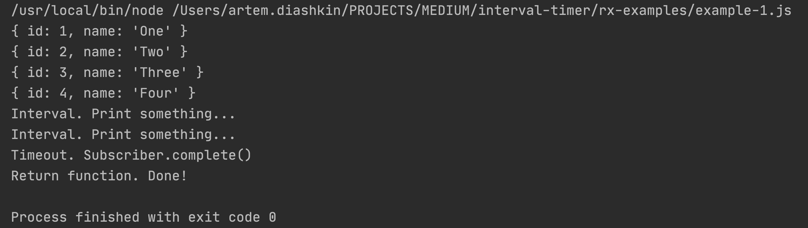
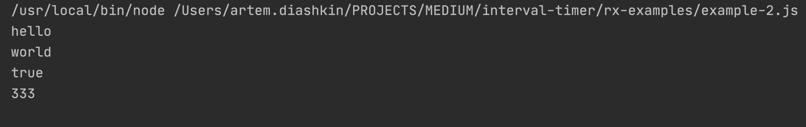
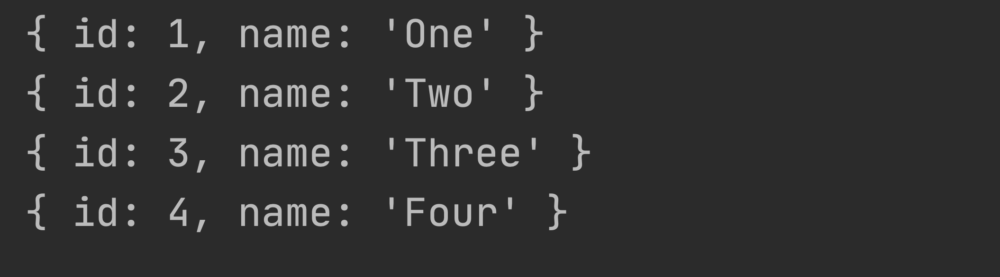
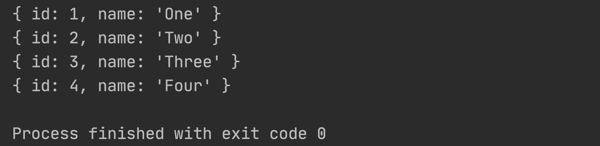
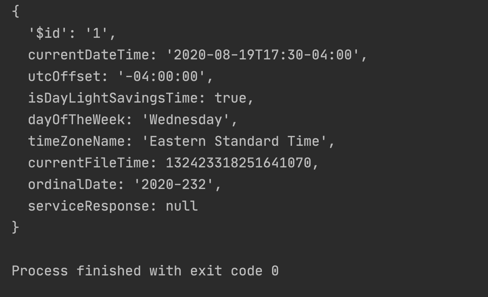
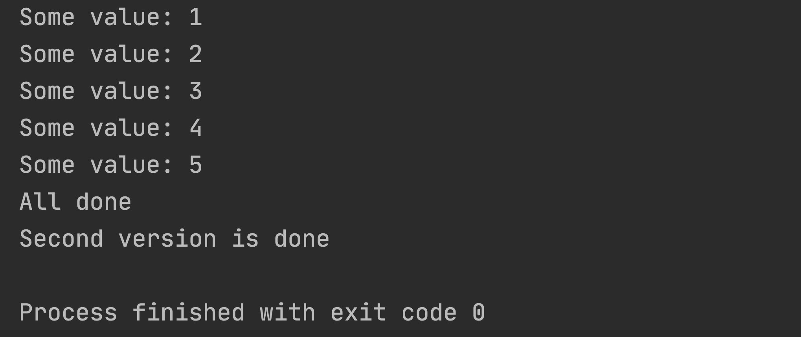
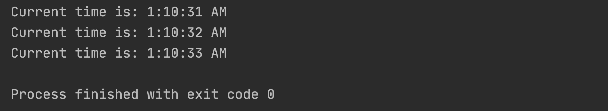
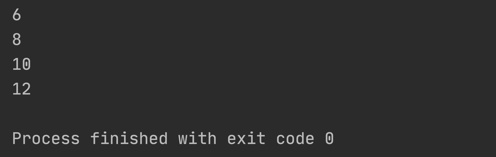

## Example-1 (next/error/complete)

## Example-2 (of)

## Example-3 (from)

## Example-4 (concat)

## Example-6 (ajax request)

## Example-7 (own Observers)


## Example-8 (multiple Observers)


## Example-9 (unsubscribe)
No image

## Example-10 (Add function + own interval implementation)
```javascript
const timerOne = timer$(1000).subscribe(
// some code
);

const timerTwo = timer$(1000).subscribe(
// some code
);

// !!! Result with this line commented
// timerOne.add(timerTwo) 
```
.jpg)
```javascript
const timerOne = timer$(1000).subscribe(
// some code
);

const timerTwo = timer$(1000).subscribe(
// some code
);

timerOne.add(timerTwo)  // <---- with add function !!!!
```
.jpg)

---
## Example-11 (operators)

Categories of operators:
- Transformation;
- Filtering;
- Combination;
- Utility;
- Conditional;
- Aggregate;
- Multicasting;

Marble Diagram: https://rxmarbles.com/#combineLatest


```javascript
const {of} = require('rxjs');
const {map, filter} = require('rxjs/operators');

of(1, 2, 3, 4, 5, 6).pipe(
    map(value => value * 2),
    filter(value => value > 5)
).subscribe(val => console.log(val));
```


---
## Example-12 (mergeMap/tap operators)
```javascript
const {ajax} = require('rxjs/ajax');
const {mergeMap, filter, tap} = require('rxjs/operators');

// Solves CORS issue in Node
const XMLHttpRequest = require("xmlhttprequest").XMLHttpRequest;

ajax({
    url: "http://worldtimeapi.org/api/timezone",
    method: 'GET',
    // ! Solves CORS issue
    crossDomain: true,
    // ! Solves CORS issue
    createXHR: function () {
        return new XMLHttpRequest();
    }
}).pipe(
    mergeMap(res=>res.response),
    filter(res=>res.includes('Europe')),
    tap(res=>res) // additional action, like log
)
    .subscribe(result => {
        console.log(result);
    })
```

